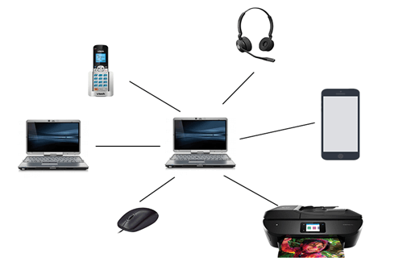

<h1 align="center">Basic Networking Concepts</h1>

### What is network?

A network can be defined as a group of devices connected in some way so that they exchange resources, files or any data between them. They can be connected through cables or radio waves or satellites or any other way which help them to communicate with each other. Minimum 2 devices required to create a network.

### Types of Networks

- **Personal Area Network (PAN)**: PAN is the most basic type of network. This network create around an individual person. PAN offers a network range of 10 meters from a person to the device providing communication.

- **Local Area Network (LAN)**: LAN is a group of devices connected to each other in a small area such as home or office building. LAN is used for connecting two or more personal devices.

- **Wide Area Network (WAN)**: WAN is a type of network that can able to connect devices over large geographical distance. It's a group of local area networks that communicate with each other. The most common example is Internet.

- **Metropolitan Area Network (MAN)**: A MAN is a larger than LAN but smaller than WAN. 

- **Campus Area Network (CAN)**: CAN is bigger than LAN but smaller than MAN.

Those are the common types of networks but there are some other types of network as well like, SAN, POLAN, EPN, VPN, HAN.

All this network can be wired or wireless. If those networks are wireless then called it WPAN, WLAN, WWAM, WMAN, WCAN.