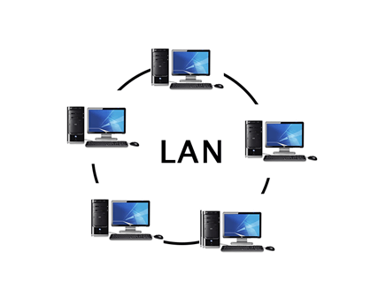

<h1 align="center">Basic Networking Concepts</h1>

### What is network?

A network can be defined as a group of devices connected in some way so that they exchange resources, files, or any data between them. They can be connected through cables or radio waves or satellites or any other way which helps them to communicate with each other. Minimum 2 devices are required to create a network.

### Types of Networks

- **Personal Area Network (PAN)**: PAN is the most basic type of network. This network create around an individual person. For example, if you have an iPhone and a Mac, it’s very likely you’ve set up a PAN that shares and syncs messages, emails, photos, and more-across both devices.

    

- **Local Area Network (LAN)**: LAN is a group of devices connected with each other in a small area such as home or office building. Typically, LANs are privately owned and managed.

    

- **Wide Area Network (WAN)**: WAN is a type of network that can able to connect devices over large geographical distance such as one region to another region. It helps LANs to communicate with each other. The most common example is Internet.

    

- **Metropolitan Area Network (MAN)**: A MAN is a larger than a LAN but smaller than a WAN. It's use to connect entire cities. Government typically own and manage this type of network.

    

- **Campus Area Network (CAN)**: CAN is bigger than LAN but smaller than MAN. It helps to connect several building of office or school or colleges.

    

Those are the common types of networks but there are some other types of networks as well like SAN (storage area network), EPN (Enterprise Private Network), VPN (Virtual Private Network), HAN (Home Area Network) and so one.

All these networks can be wired or wireless. If those networks are wireless, they are called WPAN, WLAN, WWAN, WMAN, WCAM.
