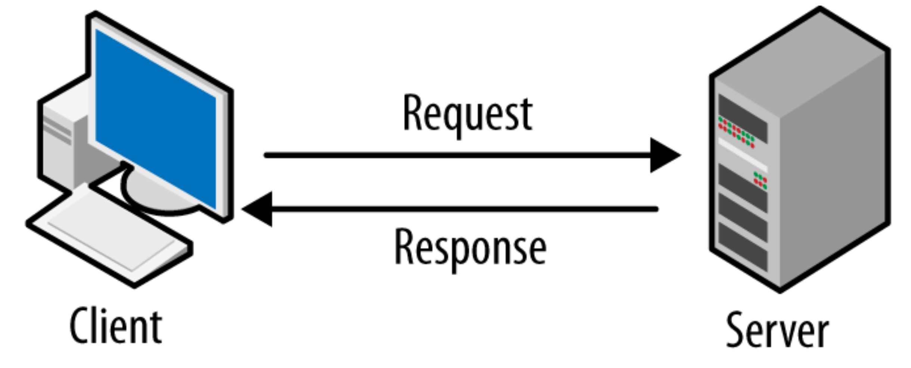
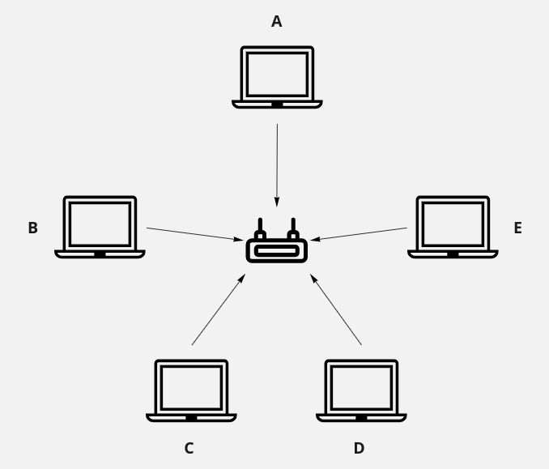
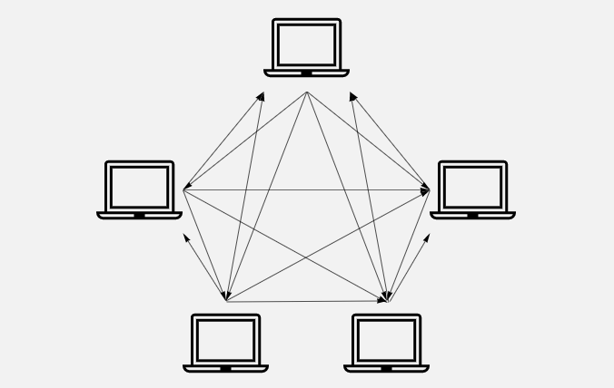
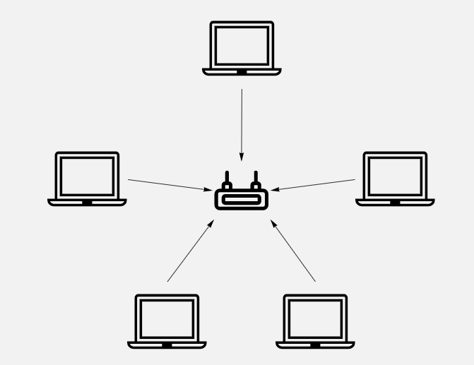

<h1 align="center">Network Devices</h1>

## Host

Any device which able to connect with a network and send or receive data is known as host. It can be mobile, computer, printer, server, IoT enabled devices like TV, Refrigerator, Light, Fan, Speaker anything.

Host can be divided into two categories.

- Client: Client are those devices which send data.
- Server: Server are those devices which receive data.

    

## Repeaters

Wire helps to establish communication among computers but When data travel a longer distance through wire, data will start losing its strength and will be corrupted. If the wire length is more than 100 meters data will be corrupted and the receiver device not get the right data. To solve this problem Repeater was invented. Repeater amplifies the data strength so that data can travel a longer distance.

    

But Repeaters also have some limitations as well. Repeater only has two ports so you can't connect more than two computer. So you if want to connect 5 computers, each computer needs to connect with other computers individually. It's create a very complicated network system and it simply doesn't scale because if increase 1 device we need to create 5 more connection.

    

To resolve this problem, one centralize device needed where all computers are connected with that device.

**Important**: you can't use more than 4 repeaters to cover longer distances otherwise again data will be corrupted. So, it will cover a maximum of 500 meters.

## Hub

Hub is nothing but a multi-port repeater. Hub invented to resolve network scale issue. We can connect multiple computers with hub and it will pass the data to other computers. Suppose, we want to connect another computer in the network, just make a connection with hub make the computer available in the network. So it's resolve the network scale problem.

    

Hub sent data one computer to all other computers but suppose you want to sent data computer A to computer B that not possible with we need some thing else for this functionality. Here comes the Bridge.

## Bridge
